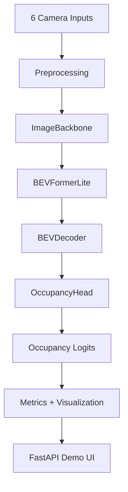
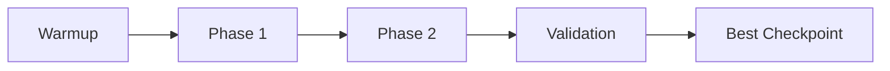

# 🌟 BEV-NET - Complete Pipeline Documentation


📍 **Project Type**: End-to-end BEV occupancy prediction system  
🔗 **GitHub Repository**: https://github.com/nirajj12/Bird-s-Eye-View-BEV-2D-Occupancy  
📊 **Dataset Used**: **nuScenes mini**  
🧠 **Core Goal**: Predict a 2D Bird's-Eye View occupancy map from 6 surround-view cameras  
🎯 **Best Validation IoU**: **0.3649**  
📉 **DWE**: **0.1137**

---

## 1. Project Overview

BEV-NET is an end-to-end autonomous-driving perception project that converts six surround-view RGB images into a top-down occupancy map. It combines multi-camera feature extraction, geometry-aware BEV projection, BEV decoding, occupancy prediction, evaluation metrics, and an interactive FastAPI demo interface.

The system is built around a custom **BEVOccupancyModel** with four main components: **ImageBackbone**, **BEVFormerLite**, **BEVDecoder**, and **OccupancyHead**. It outputs a `200 x 200` BEV occupancy grid and supports both dataset-based inference and fixed-calibration custom uploads.

---

## 2. Model Architecture

The model takes 6 camera images plus camera intrinsics and extrinsics as input and produces a BEV occupancy grid as output.

### Components

- **ImageBackbone**  
  Shared CNN backbone applied to each of the 6 camera views.

- **BEVFormerLite V3.1**  
  Geometry-aware view transformer that samples features across multiple height levels and projects them into BEV coordinates.

- **BEVDecoder**  
  2D BEV refinement network that upsamples and smooths the BEV feature map.

- **OccupancyHead**  
  Final layer that outputs:
  - Main occupancy logits: `B x 1 x 200 x 200`
  - Auxiliary logits: `B x 1 x 200 x 200`

### Inputs and Outputs

- **Inputs**
  - Images: `B x 6 x 3 x H x W`
  - Intrinsics: `B x 6 x 3 x 3`
  - Extrinsics: `B x 6 x 4 x 4`

- **Outputs**
  - Main occupancy logits: `B x 1 x 200 x 200`
  - Auxiliary logits: `B x 1 x 200 x 200`
  - Binary BEV map after sigmoid + thresholding

### System Overview Diagram



### Training Flow Diagram



---

## 3. Dataset Used

This project uses the **nuScenes mini** dataset for training and evaluation.

- **Total samples**: 404  
- **Training samples**: 323  
- **Validation samples**: 81  

Each sample provides:
- 6 synchronized surround-view RGB camera images  
- Camera intrinsics and extrinsics for each camera  
- BEV occupancy ground-truth built from LiDAR-based occupancy mapping  

The BEV grid is:
- Resolution: `200 x 200`  
- Cell size: `0.4 m` per cell  

**Relevant Code**

- `data/nuscenesloader.py` – dataset and dataloaders  
- `data/preprocess.py` – image resizing/normalization and calibration preprocessing  
- `scripts/extract_fixed_calib.py`, `sanitycheckgeometry.py` – fixed calibration and geometry sanity checks  

---

## 4. Setup & Installation Instructions

### 4.1 Clone the Repository

```bash
git clone https://github.com/nirajj12/Bird-s-Eye-View-BEV-2D-Occupancy.git
cd Bird-s-Eye-View-BEV-2D-Occupancy
```

### 4.2 Install Dependencies

```bash
pip install -r requirements.txt
```

### 4.3 Prepare the Dataset

1. Download the **nuScenes mini** dataset from the official source.  
2. Place it in the dataset directory configured in your project (see `config/config.py`).  
3. Adjust the dataset path in the config if needed.

---

## 5. How to Run the Code

### 5.1 Training

The model is trained using a phased strategy.

**Training configuration**

- Optimizer: **AdamW**  
- Learning rate: `2e-4`  
- Weight decay: `1e-4`  
- Scheduler: **Cosine Annealing LR**  
- Epochs: `60`  
- Gradient clipping: **enabled**  

**Phases**

- **Warmup**  
  - Losses: focal + dice + auxiliary BCE  

- **Phase 1**  
  - Adds Distance Weighted Error (DWE)  
  - Adds confidence regularization  
  - Adds total variation (TV) regularization  

- **Phase 2**  
  - Increases DWE weight  
  - Focuses on reducing spatially critical errors  

**Loss components**

- Focal loss  
- Dice loss  
- Auxiliary BCE loss  
- Distance Weighted Error (DWE)  
- Confidence regularization  
- TV regularization  

> You can adapt the exact training command based on your training script (e.g., `python train.py`).

### 5.2 Running the FastAPI Demo

Start the FastAPI app:

```bash
uvicorn main:app --reload
```

Then open the local URL printed in the terminal.

The app supports three modes:

- **Dataset browser**: select any validation sample  
- **Featured scenes**: curated interesting scenarios (night, rain, construction, parking, etc.)  
- **Custom upload**: upload 6 custom images with fixed nuScenes calibration  

---

## 6. Example Outputs / Results

### 6.1 Demo Preview

The FastAPI demo includes a cinematic BEV-style interface for scene selection, multi-camera input review, inference execution, and occupancy evaluation.

#### UI Gallery

**Landing screen**


**Dataset browser with six camera feeds**


**Occupancy results and live performance metrics**


### 6.2 Model Performance Summary

| Metric | Value |
|---|---:|
| **Occupancy IoU** | **0.3649** |
| **DWE** | **0.1137** |
| **Precision** | **0.4520** |
| **Recall** | **0.6110** |
| **F1 Score** | **0.5146** |
| **IoU Near Ego** | **0.6278** |
| **IoU Far Field** | **0.3150** |
| **IoU Improvement vs V2** | **+0.0638** |
| **DWE Improvement vs V2** | **-0.1186** |

Validation is performed on **81** samples with **per-sample** IoU and DWE computation for accurate tracking.

### 6.3 Model Comparison: Baseline vs Latest

To show clear progress, we report both the V2 baseline model and the final V3 model.

| Model | IoU | DWE | Precision | Recall | F1 |
|---|---:|---:|---:|---:|---:|
| **V2 Baseline** | 0.3011 | 0.2323 | 0.4369 | 0.5218 | 0.4734 |
| **V3 Final** | 0.3649 | 0.1137 | 0.4520 | 0.6110 | 0.5146 |

**Improvements**

- IoU: **+0.0638** (≈ 21.2% relative gain over V2)  
- DWE: **−0.1186** (≈ 51.1% relative reduction vs V2)  

This shows that the V3 training schedule, DWE-aware losses, and architectural tweaks significantly improve both accuracy and spatial error behavior.

### 6.4 Qualitative Outputs (Recommended)

This section highlights how the six-camera input is transformed into a BEV occupancy map and how prediction quality varies across strong, average, and failure cases.

#### Image-to-BEV Pipeline Visualization


#### Validation Showcase Summary


#### Best Validation Sample


#### Random Validation Sample


#### Worst Validation Sample


---

## 7. Demo Interface (FastAPI Frontend)

**Stack**: FastAPI + HTML + CSS + JavaScript

### Features

- Scene browser for nuScenes mini validation data  
- Featured scenario selection  
- Upload mode with fixed nuScenes intrinsics/extrinsics  
- BEV probability heatmap  
- Binary occupancy map with TP / FP / FN color coding  
- Hover-based cell inspection (distance from ego, probability, GT vs prediction)  
- Threshold slider with live metric updates  
- Metrics panel (IoU, DWE, precision, recall, F1)

### Main API Routes

- `GET /api/samples` – list available validation scenes  
- `GET /api/sample-preview/{index}` – return camera previews for a sample  
- `POST /api/predict-sample/{index}` – run inference on a dataset sample  
- `POST /api/predict-upload` – run inference on 6 user-uploaded images  

---

## 8. Project Structure

```bash
.
├── app/
│   └── main.py
├── assets/
│   └── readme/
├── checkpoints/
├── config/
│   └── config.py
├── data/
│   ├── nuscenes_loader.py
│   └── preprocess.py
├── dataset/
│   └── nuscenes_data/
├── exception/
│   └── custom_exception.py
├── logger/
│   └── custom_logger.py
├── logs/
├── models/
│   ├── backbone.py
│   ├── bev_decoder.py
│   ├── bev_former_lite.py
│   └── bev_model.py
├── notebooks/
├── results/
├── sanity_output/
├── scripts/
│   ├── extracted_fixed_calib.py
│   ├── find_featured_samples.py
│   └── sanity_check_geometry.py
├── static/
│   ├── css/
│   └── js/
├── templates/
│   └── index.html
├── utils/
│   ├── metrics.py
│   └── visualize.py
├── fixed_E.npy
├── fixed_K.npy
├── requirements.txt
├── train.py
└── README.md
```

---

## 9. Technologies Used

| Category | Tools Used |
|---|---|
| Language | Python |
| Deep Learning | PyTorch |
| Dataset | nuScenes mini |
| Geometry | Camera intrinsics, extrinsics, BEV projection |
| Model Stack | ImageBackbone, BEVFormerLite V3.1, BEVDecoder, OccupancyHead |
| Backend | FastAPI |
| Frontend | HTML, CSS, JavaScript |
| Visualization | Matplotlib, custom canvas rendering |
| Utilities | NumPy, tqdm |
| Version Control | Git, GitHub |

---

## 10. Future Enhancements

- Add temporal fusion over multiple frames  
- Improve far-field occupancy accuracy  
- Add Docker support for easy deployment  
- Integrate experiment tracking dashboards  
- Add explainability overlays for camera→BEV contributions  
- Extend from binary occupancy to richer BEV semantics (e.g., drivable area, lanes, objects)  

---

## 11. Acknowledgments

- **Hackathon**: Built for the **MAHE Mobility Challenge – Autonomous Mobility Hackathon**  
- **Dataset**: nuScenes mini  
- **Frameworks**: PyTorch and FastAPI  
- **Focus Area**: Multi-camera BEV occupancy prediction and visualization  

---

## 🧑‍💻 Author

**Niraj Kumar – AIML Engineer**  
GitHub: https://github.com/nirajj12  
Linkedin:https://www.linkedin.com/in/niraj-kumar-8255111b8/

**Aditya Kumar**  
GitHub: https://github.com/adityaxkr 
Linkedin:https://www.linkedin.com/in/adityaxkr/ 

⭐ If you found this project useful, consider starring the repository!
