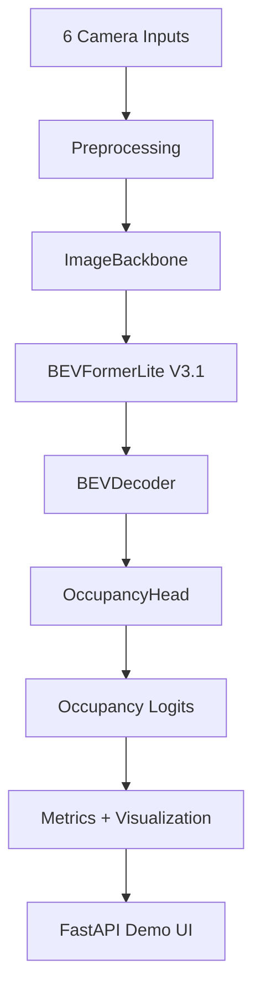
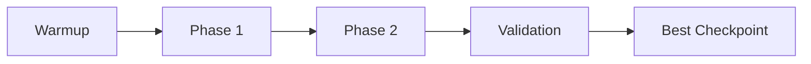

# 🌟 BEV-NET - Complete Pipeline Documentation


📍 **Project Type**: End-to-end BEV occupancy prediction system  
🔗 **GitHub Repository**: `https://github.com/nirajj12/Bird-s-Eye-View-BEV-2D-Occupancy`  
📊 **Dataset Used**: **nuScenes mini**  
🧠 **Core Goal**: Predict a 2D Bird's-Eye View occupancy map from 6 surround-view cameras  
🎯 **Best Validation IoU**: **0.3649**  
📉 **Corrected DWE**: **0.1137**

---

## 🧩 Overview

BEV-NET is an end-to-end autonomous-driving perception project that converts six surround-view RGB images into a top-down occupancy map. It combines multi-camera feature extraction, geometry-aware BEV projection, BEV decoding, occupancy prediction, evaluation metrics, and an interactive FastAPI demo interface.

The project is built around a custom **BEVOccupancyModel** pipeline consisting of **ImageBackbone**, **BEVFormerLite V3.1**, **BEVDecoder**, and **OccupancyHead**.

---

## 📌 Project Objective

To build a complete computer vision system that can:

- Take 6 synchronized surround-view camera images as input.
- Generate a 2D BEV occupancy map.
- Evaluate predictions using IoU, corrected DWE, precision, recall, and F1 score.
- Support both dataset-based inference and custom upload inference.
- Provide an interactive web interface for visualization and analysis.

---

## 🖼️ Demo Preview

> Add screenshots here after uploading assets to your repository.

```md


```

---

## 🚧 Full Project Pipeline

### 📁 1. Data Loading

**Objective**: Load nuScenes mini samples and prepare training and validation sets.

**Steps**:

- Load 6 camera images, intrinsics, extrinsics, and occupancy targets.
- Build BEV supervision from LiDAR-based occupancy mapping.
- Split the dataset into training and validation subsets.
- Final split used: **323 train / 81 validation**.

**Code Modules**:
- `data/nuscenesloader.py`
- `data/preprocess.py`

### 🔄 2. Preprocessing and Geometry

**Objective**: Convert raw inputs into tensors suitable for BEV learning.

**Steps**:

- Resize and normalize camera images.
- Process camera intrinsic matrices.
- Process camera extrinsic matrices.
- Generate BEV occupancy targets.
- Support fixed calibration extraction for upload mode.

**Related Files**:
- `data/preprocess.py`
- `scripts/extract_fixed_calib.py`
- `sanitycheckgeometry.py`

### 🧠 3. Model Architecture

**Objective**: Transform multi-camera image features into BEV occupancy predictions.

**Architecture**:

- **ImageBackbone**: Shared feature extractor across all 6 cameras.
- **BEVFormerLite V3.1**: Geometry-aware BEV projection using multiple sampled height levels.
- **BEVDecoder**: Refines BEV features spatially.
- **OccupancyHead**: Produces main occupancy logits and auxiliary logits.

**Input Shapes**:
- Images: `B x 6 x 3 x H x W`
- Intrinsics: `B x 6 x 3 x 3`
- Extrinsics: `B x 6 x 4 x 4`

**Output Shapes**:
- Main occupancy logits: `B x 1 x 200 x 200`
- Auxiliary logits: `B x 1 x 200 x 200`

**Code Modules**:
- `models/backbone.py`
- `models/bevformerlite.py`
- `models/bevdecoder.py`
- `models/bevmodel.py`

### 🏋️ 4. Training Strategy

**Objective**: Optimize BEV occupancy quality using phased loss scheduling.

**Training Configuration**:

- **Optimizer**: AdamW
- **Learning Rate**: `2e-4`
- **Weight Decay**: `1e-4`
- **Scheduler**: Cosine Annealing LR
- **Epochs**: `60`
- **Gradient Clipping**: Enabled

**Training Phases**:

- **Warmup (1-5)**: Focal + Dice + Auxiliary BCE
- **Phase 1 (6-40)**: Adds DWE, confidence regularization, and TV regularization
- **Phase 2 (41-60)**: DWE-focused loss weighting

**Loss Components**:

- Focal loss
- Dice loss
- Auxiliary BCE
- Distance Weighted Error (DWE)
- Confidence regularization
- Total variation regularization

### 📦 5. Inference Pipeline

**Objective**: Run trained checkpoints on validation scenes or uploaded custom images.

**Supported Modes**:

- Dataset browser mode
- Featured scenario mode
- Custom 6-camera upload mode

**Prediction Flow**:

- Input images + calibration
- Model forward pass
- Sigmoid over occupancy logits
- Thresholding into a binary occupancy grid
- Metric computation and visualization response

**Main App File**:
- `main.py`

### 🎨 6. Demo Interface

**Framework**: FastAPI + HTML/CSS/JavaScript

**Features**:

- Scene browser for validation data
- Featured scenario selection
- Upload mode with fixed calibration
- Probability heatmap visualization
- Binary occupancy map visualization
- Error legend for TP / FP / FN
- Hover-based cell inspection
- Live threshold control
- Real-time metric refresh

**API Routes**:

- `/api/samples`
- `/api/sample-preview/{index}`
- `/api/predict-sample/{index}`
- `/api/predict-upload`

---

## 🏗️ Architecture Diagrams

### System Overview



### Training Flow



---

## 📊 Model Performance Summary

| Metric | Value |
|---|---:|
| **Occupancy IoU** | **0.3649** |
| **Corrected DWE** | **0.1137** |
| **Precision** | **0.4520** |
| **Recall** | **0.6110** |
| **F1 Score** | **0.5146** |
| **IoU Near Ego** | **0.6278** |
| **IoU Far Field** | **0.3150** |
| **IoU Improvement vs V2** | **+0.0638** |
| **DWE Improvement vs V2** | **-0.1186** |

---

## 💡 Technologies Used

| Category | Tools Used |
|---|---|
| Language | Python |
| Deep Learning | PyTorch |
| Dataset | nuScenes mini |
| Geometry | Camera intrinsics, extrinsics, BEV projection |
| Model Stack | ImageBackbone, BEVFormerLite, BEVDecoder, OccupancyHead |
| Backend | FastAPI |
| Frontend | HTML, CSS, JavaScript |
| Visualization | Matplotlib, canvas rendering |
| Utilities | NumPy, tqdm |
| Version Control | Git, GitHub |

---

## 🧠 How It Works - User Flow

### 👤 User Input

- Select a validation scene.
- Pick a featured scenario.
- Or upload 6 custom surround-view camera images.

### 🔁 Prediction Pipeline

- Input Images → Preprocessing → Backbone → BEVFormerLite → Decoder → Occupancy Head → BEV Map

### 📊 Result Display

- Occupancy probability heatmap
- Binary occupancy visualization
- Error analysis view
- IoU, DWE, precision, recall, and F1 summary

---

## 🗂️ Project Structure

```bash
.
├── data/
├── models/
├── scripts/
├── utils/
├── static/
├── templates/
├── notebook/
├── artifacts/
├── main.py
├── requirements.txt
└── README.md
```

---

## ▶️ Installation and Usage

### 1. Clone the repository

```bash
git clone <your-repo-url>
cd <your-project-folder>
```

### 2. Install dependencies

```bash
pip install -r requirements.txt
```

### 3. Prepare the dataset

- Download **nuScenes mini**.
- Place it in the dataset directory configured in your project.
- Update config paths if needed.

### 4. Run the application

```bash
uvicorn main:app --reload
```

### 5. Open the app

- Visit the local server URL shown in the terminal.
- Browse scenes or upload camera images.
- Run inference and inspect the BEV outputs.

---

## 🧪 Evaluation Highlights

- Validation performed on **81** samples.
- Per-sample validation used for accurate IoU and DWE computation.
- Near-ego occupancy quality is much stronger than far-field occupancy.
- Best validation IoU reached **0.3649**.
- Corrected DWE reached **0.1137**.

---

## 🚀 Future Enhancements

- Add temporal fusion over multiple frames.
- Improve far-field occupancy accuracy.
- Add Docker support for deployment.
- Add experiment tracking dashboards.
- Add explainability overlays for camera contribution.
- Extend to richer BEV semantic outputs.

---

## 🙌 Acknowledgments

- **Dataset**: nuScenes mini
- **Frameworks**: PyTorch and FastAPI
- **Focus Area**: Multi-camera BEV occupancy prediction and visualization

---

