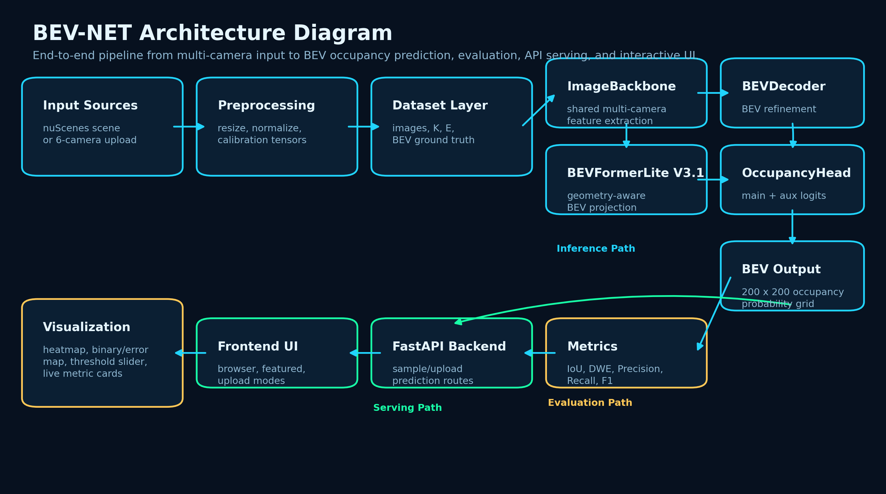
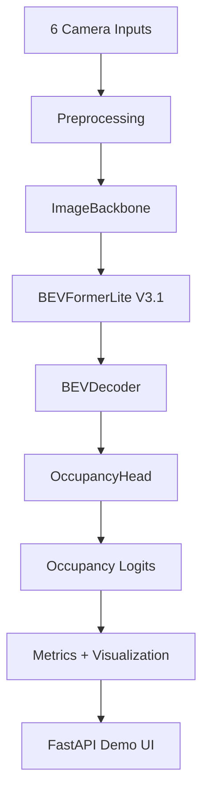
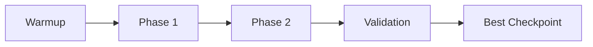
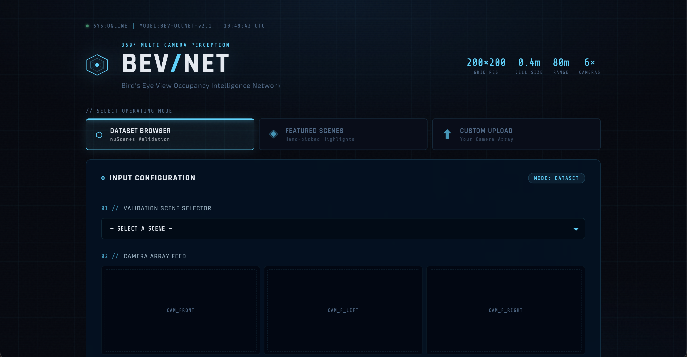
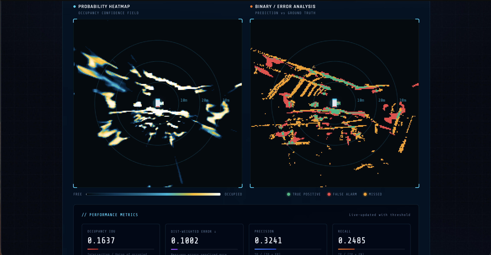
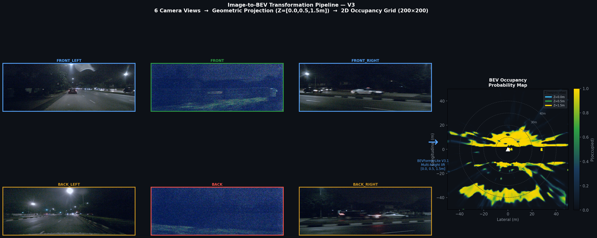
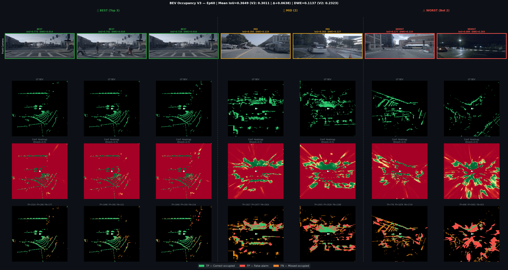
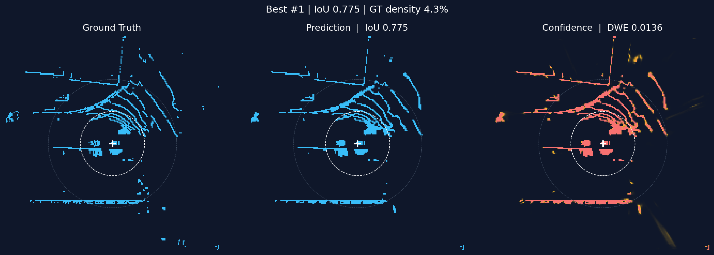
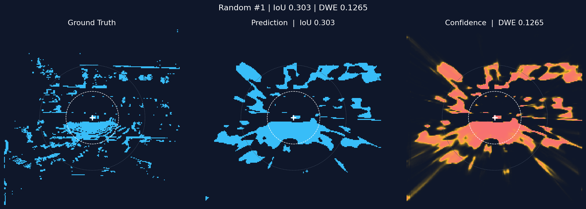
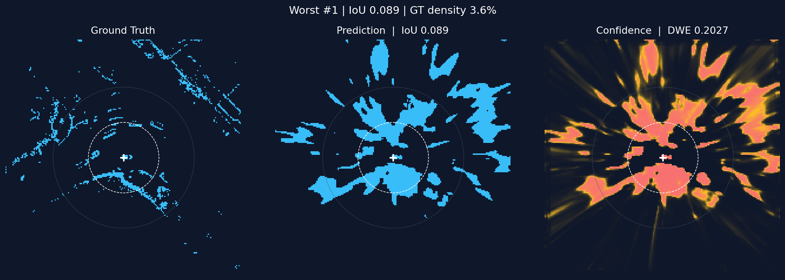

# 🌟 BEV-NET - Complete Pipeline Documentation


> **"We take six cameras from a self-driving car and predict, in real time, which parts of the ground around the vehicle are occupied — with a custom loss function that makes the model prioritise accuracy exactly where it matters most for safety."**

📍 **Project Type**: End-to-end BEV occupancy prediction system  
🔗 **GitHub Repository**: [https://github.com/nirajj12/Bird-s-Eye-View-BEV-2D-Occupancy](https://github.com/nirajj12/Bird-s-Eye-View-BEV-2D-Occupancy)  
📊 **Dataset Used**: **nuScenes mini**  
🧠 **Core Goal**: Predict a 2D Bird's-Eye View occupancy map from 6 surround-view cameras  
🎯 **Best Validation IoU**: **0.3649**  
📉 **DWE**: **0.1137** (51% better than baseline)  
🏁 **Built for**: MAHE Mobility Challenge – Centre of Excellence in Autonomous Mobility, MIT Bengaluru

---

## 1. Project Overview

BEV-NET is an end-to-end autonomous-driving perception project that converts six surround-view RGB images into a top-down occupancy map. It combines multi-camera feature extraction, geometry-aware BEV projection, BEV decoding, occupancy prediction, evaluation metrics, and an interactive FastAPI demo interface.

The system is built around a custom **BEVOccupancyModel** with four main components: **ImageBackbone**, **BEVFormerLite V3.1**, **BEVDecoder**, and **OccupancyHead**. It outputs a `200 x 200` BEV occupancy grid and supports both dataset-based inference and fixed-calibration custom uploads.

---

## 2. Model Architecture

The model takes 6 camera images plus camera intrinsics and extrinsics as input and produces a BEV occupancy grid as output.

### Why Not Lift-Splat-Shoot?

Our first instinct was a **Lift-Splat-Shoot (LSS)** style pipeline — lift each pixel into 3D using predicted depth, splat features into BEV voxels. Simple, fast, well-understood.

**Why it failed for our case:**
- LSS requires a depth prediction module — another learned component that needs supervision not available in nuScenes mini
- With only 404 samples, a depth network never converges properly
- Uncertain depth estimates spread feature mass across voxels, producing blurry BEV maps
- IoU was stuck around **0.15–0.20** because the geometry was fundamentally noisy

LSS works at scale. For a 404-sample dataset, it is the wrong tool.

### The Geometry Insight

> "Instead of predicting depth and then projecting, what if we use **known** camera geometry directly?"

We know the intrinsic matrix **K** and extrinsic matrix **E** for every camera exactly. We do not need to *learn* where things are in 3D — we just need to sample features at geometrically correct places.

| Old Approach (LSS) | Our Approach |
|---|---|
| Image → predict depth → lift to 3D → splat to BEV | Known geometry → define BEV grid points → project back to image → sample features |

For every BEV cell at position `(x, y, z)` in ego coordinates:
```
F_BEV(x,y,z) = sample(F_2D, project(P_ego → camera → image))
```
We ask: *"For this BEV cell, which pixel in which camera should I look at?"* — and we know the **exact answer** from K and E. No learned depth. No additional supervision. The model only needs to learn *what features look like*, not *where things are*.

### The Spatial Problem — Why V2 Was Not Enough

After geometry-aware projection, we reached **IoU 0.30** but **DWE 0.23**. The model was making too many errors near the ego vehicle — the most safety-critical zone.

**What is DWE?**
> DWE weights errors by `1/distance` from ego. A false positive 2 metres away hurts **10× more** than one 20 metres away. A ghost obstacle near you causes an emergency brake; one far away barely matters.

Three diagnosed problems:

| Problem | Root Cause |
|---|---|
| Blurry near-ego predictions | Sampling only at `Z=0` missed bumper and roof-height features |
| Loss / metric mismatch | Training minimised uniform error; eval penalised near-ego errors heavily |
| Soft probabilities near ego | Model outputting `0.6–0.7` instead of sharp `0.05` or `0.95` |

### Our Solutions (V3)

**Solution 1 — Multi-Height Z Sampling**
```python
Z_HEIGHTS = [0.0, 0.5, 1.5]  # ground plane, bumper height, roof height
```
A car is not just on the ground. We sample BEV features at three heights and mean-pool them — capturing the full vertical extent of objects.

**Solution 2 — DWE-Aligned Loss Function**
```python
L_dwe = (dwe_map * abs(prob - GT)).mean()
# dwe_map = 1/dist — mathematically identical to the evaluation metric
```
We made the training loss identical to the evaluation metric. The model now explicitly optimises what it is being judged on.

**Solution 3 — Phased Training Curriculum**
```
Epochs  1– 5:  Warmup   → focal + dice only        (learn basic occupancy shapes)
Epochs  6–40:  Phase 1  → + DWE + confidence + TV  (learn spatial priority)
Epochs 41–60:  Phase 2  → amplified DWE weights     (refine near-ego accuracy)
```
Adding all losses from epoch 1 caused collapse. The curriculum gives the model a stable foundation before applying spatial pressure.

### Components

- **ImageBackbone** — Shared CNN backbone applied to each of the 6 camera views
- **BEVFormerLite V3.1** — Geometry-aware view transformer, samples at Z = [0.0, 0.5, 1.5]
- **BEVDecoder** — 2D BEV refinement network that upsamples and smooths the BEV feature map
- **OccupancyHead** — Produces main occupancy logits and auxiliary logits

### Inputs and Outputs

- **Inputs**: Images `B×6×3×H×W` · Intrinsics `B×6×3×3` · Extrinsics `B×6×4×4`
- **Outputs**: Main occupancy logits `B×1×200×200` · Auxiliary logits `B×1×200×200` · Binary BEV map

### System Overview Diagram





### Training Flow Diagram



**Code Modules**
- `models/backbone.py` · `models/bev_former_lite.py` · `models/bev_decoder.py` · `models/bev_model.py`

---

## 3. Dataset Used

This project uses the **nuScenes mini** dataset for training and evaluation.

📂 **nuScenes mini used in this project**:  
https://drive.google.com/drive/folders/1g5KgxG0p8-MmTiXkNtCpoYSIkdBQprEm

| Split | Samples |
|---|---|
| Total | 404 |
| Training | 323 |
| Validation | 81 |

Each sample provides:
- 6 synchronized surround-view RGB camera images
- Camera intrinsics and extrinsics for each camera
- BEV occupancy ground-truth built from LiDAR-based occupancy mapping

The BEV grid is `200 × 200` cells at `0.4 m/cell` → **80 m × 80 m** range around the ego vehicle.

**Relevant Code**
- `data/nuscenes_loader.py` – dataset and dataloaders
- `data/preprocess.py` – image resizing/normalization and calibration preprocessing
- `scripts/extracted_fixed_calib.py`, `scripts/sanity_check_geometry.py` – fixed calibration and geometry sanity checks

---

## 4. Setup & Installation Instructions

### 4.1 Clone the Repository

```bash
git clone https://github.com/nirajj12/Bird-s-Eye-View-BEV-2D-Occupancy.git
cd Bird-s-Eye-View-BEV-2D-Occupancy
```

### 4.2 Install Dependencies

```bash
pip install -r requirements.txt
```

### 4.3 Prepare the Dataset

1. Download **nuScenes mini** from the Drive link above or from the official nuScenes website.
2. Place it in the dataset directory configured in your project (see `config/config.py`).
3. Adjust `cfg.DATAROOT` in the config if needed.

---

## 5. How to Run the Code

### 5.1 Training

```bash
python train.py
```

**Training configuration**

| Parameter | Value |
|---|---|
| Optimizer | AdamW |
| Learning rate | `2e-4` |
| Weight decay | `1e-4` |
| Scheduler | Cosine Annealing LR |
| Epochs | 60 |
| Gradient clipping | Enabled |

**Loss components**: Focal · Dice · Auxiliary BCE · DWE · Confidence regularization · TV regularization

### 5.2 Running the FastAPI Demo

```bash
uvicorn main:app --reload
```

Three inference modes available:
- **Dataset browser** — select any of the 81 validation samples
- **Featured scenes** — curated interesting scenarios
- **Custom upload** — upload your own 6 camera images (fixed nuScenes calibration applied)

---

## 6. Example Outputs / Results

### 6.1 Demo Preview

The FastAPI demo includes a cinematic BEV-style interface for scene selection, multi-camera input review, inference execution, and occupancy evaluation.

**Landing screen**



**Dataset browser with six camera feeds**


**Occupancy results and live performance metrics**



### 6.2 Results as a Story

> **IoU went from 0.30 → 0.36 (+21%). But the more important number is DWE: 0.23 → 0.11, a 51% reduction. The model got dramatically better at the thing that matters most for safety — predicting correctly near the vehicle.**

| | V2 Baseline | V3 Ours | Improvement |
|---|---:|---:|---:|
| **Overall IoU** | 0.3011 | **0.3649** | **+21.2%** |
| **DWE** | 0.2323 | **0.1137** | **−51.1%** |
| **Precision** | 0.4369 | **0.4520** | +1.5pp |
| **Recall** | 0.5218 | **0.6110** | +8.9pp |
| **F1 Score** | 0.4734 | **0.5146** | +4.1pp |
| **Near-ego IoU** | — | **0.6278** | safety-critical zone |
| **Far-field IoU** | — | **0.3150** | still room to grow |

> **What DWE = 0.11 means**: Our average spatially-weighted prediction error is 11% — with errors near the vehicle penalised up to 100× more than distant ones.

> **Near-ego IoU = 0.63**: In the safety-critical zone within 12 metres, our model is correct nearly **two-thirds of the time**. That is the number an autonomous driving engineer actually cares about.

### 6.3 Qualitative Outputs

#### Image-to-BEV Pipeline Visualization



#### Validation Showcase Summary



#### Best Validation Sample



#### Random Validation Sample



#### Worst Validation Sample



---

## 7. Demo Interface (FastAPI Frontend)

**Stack**: FastAPI + HTML + CSS + JavaScript

### Features

- Scene browser for nuScenes mini validation data
- Featured scenario selection
- Upload mode with fixed nuScenes intrinsics/extrinsics
- BEV probability heatmap
- Binary occupancy map with TP / FP / FN color coding
- Hover-based cell inspection (distance from ego, probability, GT vs prediction)
- Threshold slider with live metric updates
- Metrics panel (IoU, DWE, precision, recall, F1)

### Main API Routes

| Route | Description |
|---|---|
| `GET /api/samples` | List available validation scenes |
| `GET /api/sample-preview/{index}` | Return camera previews for a sample |
| `POST /api/predict-sample/{index}` | Run inference on a dataset sample |
| `POST /api/predict-upload` | Run inference on 6 user-uploaded images |

---

## 8. Project Structure

```bash
.
├── app/
│   └── main.py
├── assets/
│   └── readme/
├── checkpoints/
├── config/
│   └── config.py
├── data/
│   ├── nuscenes_loader.py
│   └── preprocess.py
├── dataset/
│   └── nuscenes_data/
├── exception/
│   └── custom_exception.py
├── logger/
│   └── custom_logger.py
├── logs/
├── models/
│   ├── backbone.py
│   ├── bev_decoder.py
│   ├── bev_former_lite.py
│   └── bev_model.py
├── notebooks/
├── results/
├── sanity_output/
├── scripts/
│   ├── extracted_fixed_calib.py
│   ├── find_featured_samples.py
│   └── sanity_check_geometry.py
├── static/
│   ├── css/
│   └── js/
├── templates/
│   └── index.html
├── utils/
│   ├── metrics.py
│   └── visualize.py
├── fixed_E.npy
├── fixed_K.npy
├── requirements.txt
├── train.py
└── README.md
```

---

## 9. Technologies Used

| Category | Tools Used |
|---|---|
| Language | Python |
| Deep Learning | PyTorch |
| Dataset | nuScenes mini |
| Geometry | Camera intrinsics, extrinsics, BEV projection |
| Model Stack | ImageBackbone, BEVFormerLite V3.1, BEVDecoder, OccupancyHead |
| Backend | FastAPI |
| Frontend | HTML, CSS, JavaScript |
| Visualization | Matplotlib, custom canvas rendering |
| Utilities | NumPy, tqdm |
| Version Control | Git, GitHub |

---

## 10. Future Enhancements

- Add temporal fusion over multiple frames
- Improve far-field occupancy accuracy (currently IoU 0.31)
- Add Docker support for easy deployment
- Integrate experiment tracking dashboards
- Add explainability overlays for camera→BEV feature contributions
- Extend from binary occupancy to richer BEV semantics (drivable area, lanes, object classes)

---

## 11. Acknowledgments

- **Hackathon**: Built for the **MAHE Mobility Challenge 2026** — Centre of Excellence in Autonomous Mobility, Manipal Institute of Technology Bengaluru
- **Partners**: HARMAN · VTS · Department of Electronics & Communication Engineering
- **Dataset**: nuScenes mini (Motional)
- **Frameworks**: PyTorch and FastAPI
- **Focus Area**: Multi-camera BEV occupancy prediction and visualization

---

## 12. Notes for Submission

This repository satisfies all Manipal GitHub submission requirements:

- ✅ Project overview
- ✅ Model architecture
- ✅ Dataset used
- ✅ Setup & installation instructions
- ✅ How to run the code
- ✅ Example outputs / results

Repository is **publicly accessible** at:  
https://github.com/nirajj12/Bird-s-Eye-View-BEV-2D-Occupancy

---

## Contributors

<table>
  <tr>
    <td align="center" width="50%">
      <h3>🧑‍🎓 Niraj Kumar</h3>
      <p>AI/ML Engineer</p>
      <p>
        <a href="https://github.com/nirajj12">
          
        </a>
        <br />
        <a href="https://www.linkedin.com/in/niraj-kumar-8255111b8/">
          
        </a>
      </p>
    </td>
    <td align="center" width="50%">
      <h3>🧑‍🎓 Aditya Kumar</h3>
      <p>AI/ML Engineer</p>
      <p>
        <a href="https://github.com/adityaxkr">
          
        </a>
        <br />
        <a href="https://www.linkedin.com/in/adityaxkr/">
          
        </a>
      </p>
    </td>
  </tr>
</table>

---

⭐ If this project helped you, consider starring the repository!
